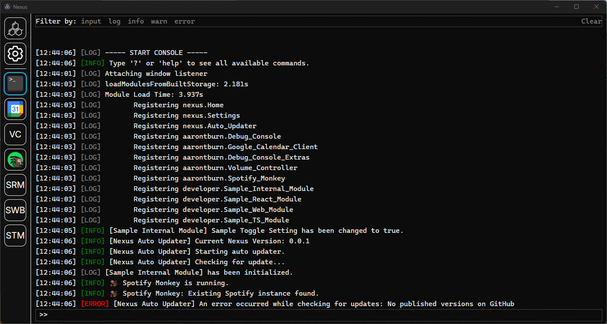

# Nexus: Debug Console

A module for [Nexus](https://github.com/aarontburn/nexus-core) that adds a debug console. This can be useful during development by adding commands to help test your module, or during production to view console output.



## Installation
1. Download the latest release `.zip`. 
2. In Nexus, navigate to **Settings** > **Import Module**
3. Select the downloaded `.zip` file to install.

## Features
- Displays all console output (both `stdout` and `stderr`).
- Run commands from internal and external modules.

## Developer Features
- Register and handle custom commands

## API
### `addCommandPrefix`
Register a command.

> **Parameters**  
> A valid command object.
> ``` typescript
> export interface Command {
>    prefix: string;
>    executeCommand: (args: string[]) => void,
>    documentation?: {
>        shortDescription?: string;
>        longDescription?: string;
>    }
> }
> ```
> **Returns**  
> `200 OK` if the command was valid and successfully registered.  
> `406 Not Acceptable` if the command was rejected.


